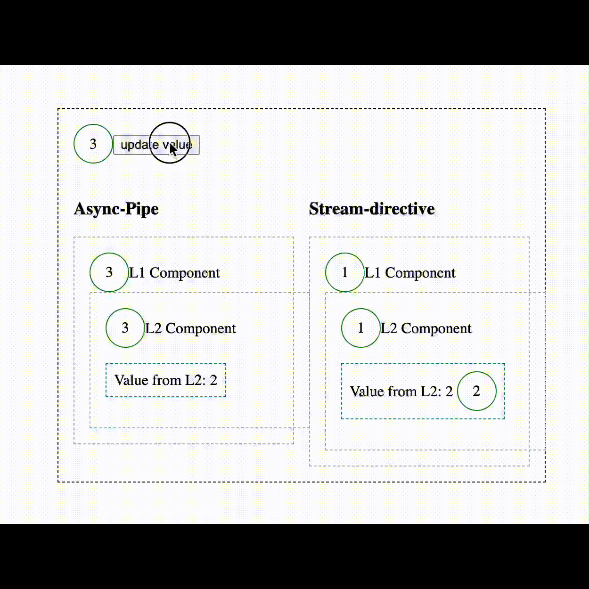

# @code-workers.io/angular-kit/stream

Secondary entry point of `@code-workers.io/angular-kit`. It can be used by importing from `@code-workers.io/angular-kit/stream`.

- ✅ Optimized change detection in comparison to `async` pipe
- ✅ Lazy by default
- ✅ Loading, error and complete states
- ✅ Easy customization via templates or components

## Usage

### Basic example

```html
<ng-container
  *stream="
    source$;
    let value;
    let error = error;
    let complete = completed;
    let loading = loading;
    loadingTemplate: loadingTemplate;
    errorTemplate: errorTemplate;
    completeTemplate: completeTemplate;
    keepValueOnLoading: true
  "
>
  {{ value }}
</ng-container>

<ng-template #loadingTemplate let-loading="loading">
  <my-spinner [loading]="loading"></my-spinner>
</ng-template>
<ng-template #errorTemplate let-error="error"> error context: {{ error }} </ng-template>
<ng-template #completeTemplate let-completed="completed"> completed context: {{ completed }} </ng-template>
```

```typescript
@Component({})
export class MyComponent {
  source$ = this.http.get('https://jsonplaceholder.typicode.com/posts/1');
}
```

### API

#### Inputs

- `source$` - Observable that will be subscribed to
- `keepValueOnLoading` - If `true` the last value will be kept on loading state. If `false` the last value will be cleared on loading state. Default value is `false`.
- `refreshSignal` - Subject that will be used to trigger refresh.
- `loadingTemplate` - Template that will be used to render loading state.
- `errorTemplate` - Template that will be used to render error state.
- `completeTemplate` - Template that will be used to render complete state.

#### Context variables

- `$implicit` - Last value emitted by `source$`
- `error` - Error emitted by `source$`
- `completed` - `true` if `source$` completed
- `loading` - `true` if `source$` is loading

### Configuration

You can configure `stream` to use defined components for loading, error and complete states instead of passing templates.

```typescript
@NgModule({
  imports: [
    StreamModule.forRoot({
      loadingComponent: MyLoadingComponent,
      errorComponent: MyErrorComponent,
      completeComponent: MyCompleteComponent,
    }),
  ],
})
export class AppModule {}
```

In your custom components you have access to the context via `STREAM_DIR_CONTEXT` injection token.

```typescript
@Component({
  selector: 'my-loading',
  template: ` <div *ngIf="loading">Loading... {{ context.loading }}</div> `,
})
export class MyLoadingComponent {
  constructor(@Inject(STREAM_DIR_CONTEXT) public context: StreamDirectiveContext) {}
}
```

_Note_ When using components and passing templates, the templates will be used instead.

## Comparision of `async`-pipe vs `*stream`-directive

If we compare a highly optimized application where all components are using `OnPush` change detection strategy we can observe that the
usage of the `async`-pipe is still quite expensive at it is internally calling `markForCheck` which marks the component itself and all of its parents for change detection.
So the whole component (sub)-tree gets re-rendered. So not only the complete template of the affected component gets re-rendered but also its parents.

`*stream` on the other hand will only update the affected tiny template-piece:


### Comparison of dirty checks: `async`-pipe vs `*stream`-directive



```typescript
tbd;
```
